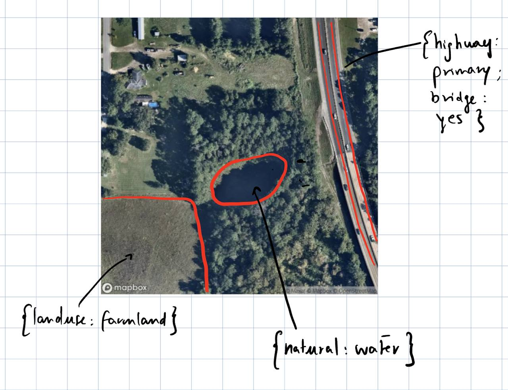
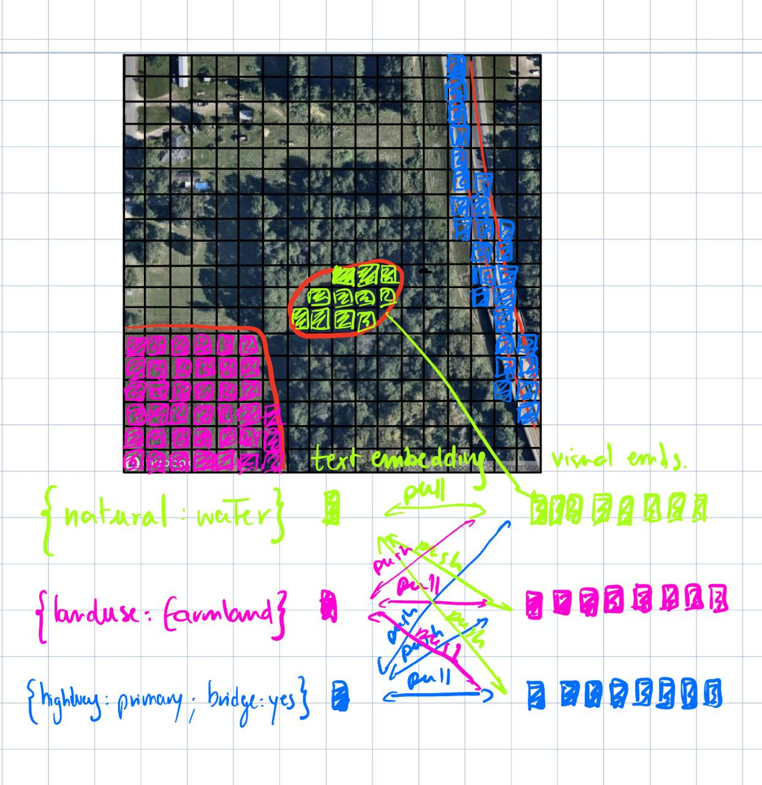

# OpenStreetCLIP
OpenStreetCLIP is a grounded CLIP model using OpenStreetMap data




The idea is pretty straightforward, leveraging OSM data and their location to train a more position aware CLIP model, that is able to integrate knowledge from diverse objects in the image.


## Usage

### Training on OSM Dataset  
```bash
python train_osm.py --config configs/config_train_osm.yaml
```

### Fine-tuning on 4 Datasets
```bash
python finetuning.py --config configs/config_finetuning.yaml
```


## Shared Utilities

The `utils/training_utils.py` module contains common functions used by both training scripts:

- `load_config()` - YAML configuration loading
- `setup_logging()` - Consistent logging configuration  
- `setup_optimizer()` - Optimizer initialization
- `setup_device()` - Device setup and validation
- `calculate_effective_batch_size()` - Batch size calculations
- `validate_common_config()` - Configuration validation
- `log_training_config()` - Clean configuration logging

## Configuration Files

### `config_finetuning.yaml`
- Model settings (CLIP version, image size, etc.)
- Training parameters (learning rate, batch size, optimizer)
- Dataset configuration
- Gradient accumulation settings
- Logging and checkpoint options

### `config_train_osm.yaml`
- OSM-specific model settings (patch size, etc.)
- Training parameters
- Dataset path and preprocessing options
- Device configuration